# EPaper Clock and Weather Station

This project is an EPaper clock and weather station that automatically sets
itself (via GPS) and can be built to last about 6 months on 4 AAA batteries.
It purposefully does not need any network connections for the sake of security
and reliability.

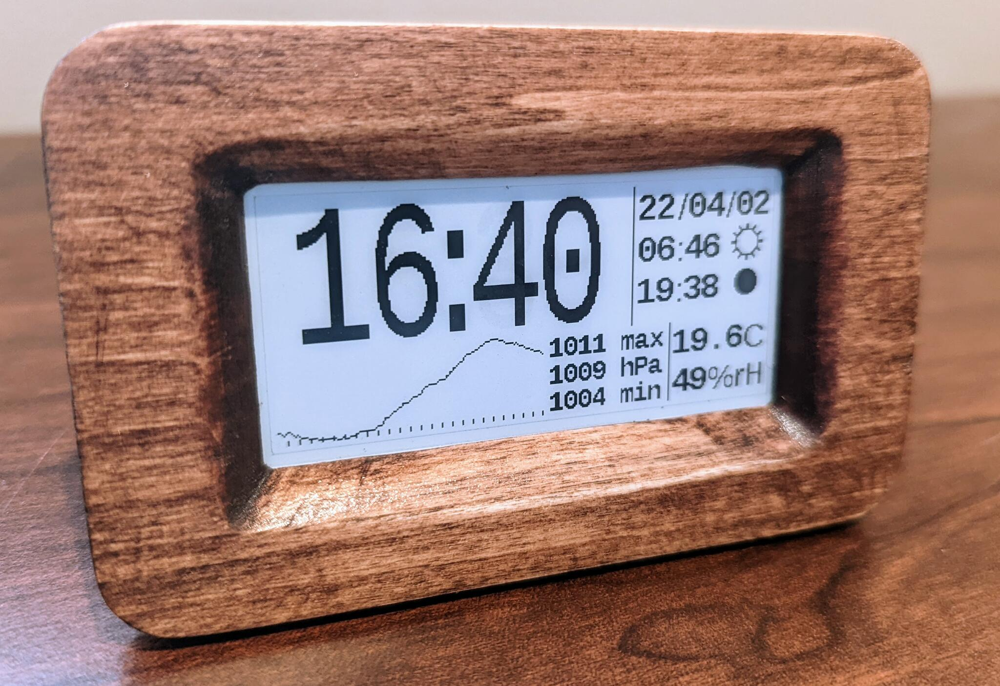

Here is a video overview:

Features include:

   * Autoset (via GPS)
   * Current temperature.
   * Current humidity.
   * A pressure graph showing pressure over the last 25 hours.
   * Sunrise and Sunset times
   * Current moon phase
   * Select between 12h or 24h modes.
   * Select between English and metric units.

I put together two main variants of the project: "easy" and "low power".

The "easy" version is based on the Arduino Nano.  The intent with this
variation is to minimize cost and part count. The downside is that you'll need
to power the clock from a USB 5V adapter.

The "low power" version replaces the nano with a bare Atmega328P chip,
configured with a 32k crystal.  Under this configuration, the chip uses < 1
uA except when it is woken up by the crystal once per second.  This means
that the clock can be powered for a long time on batteries, even when power
draw from other devices is accounted for (all devices included draw 30-70
uA during while sleeping, and they are sleeping most of the time).

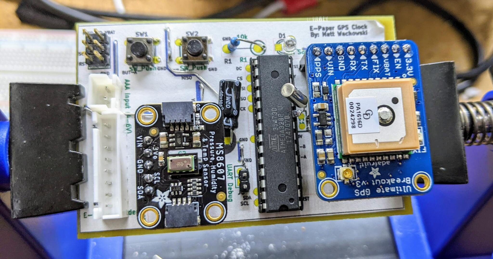

Both versions are designed to be buildable on a breadboard for experimentation.
The final board is designed to be buildable by any of several techniques:
prototype boards, CNC milling, chemical etchings, or ordering a PCB from the
provided design files are all options.

# Parts List

## "Easy" version

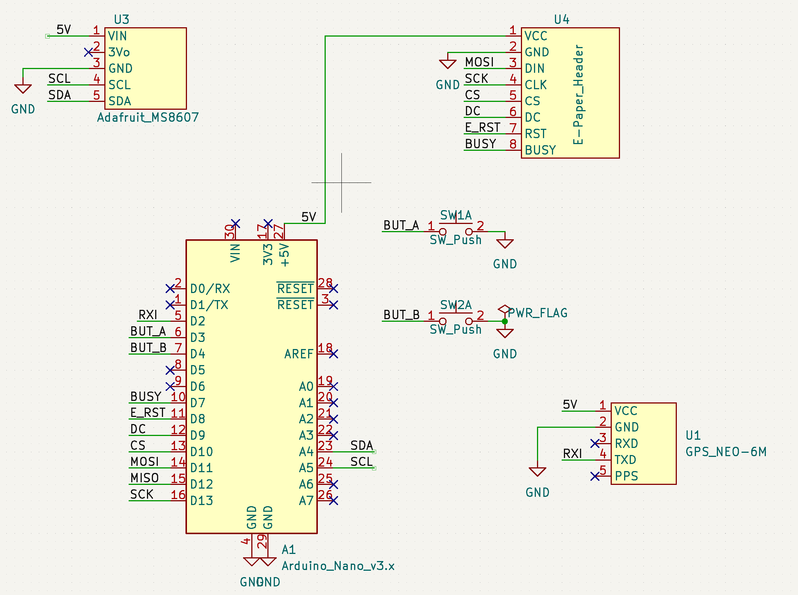

   * _Arduino Nano (or clone) ($3)_.  I went with a
     [clone board on Amazon](https://www.amazon.com/ELEGOO-Arduino-ATmega328P-Without-Compatible/dp/B0713XK923) but
     with April 2022 prices, I'd consider ebay as well.
   * _Waveshare 2.9 in EPaper Module ($22)_.  Purchase direct from Waveshare or
     [from amazon](https://www.amazon.com/2-9inch-Display-Module-Two-Color-Interface/dp/B07VD1V1YB).
   * _Adafruit MS8607 Pressure / Humidity / Temperature Sensor ($15)_.
     [link](https://www.adafruit.com/product/4716) I chose this one because of
     it's low power draw.
   * _Any basic GPS module with 9600 Baud TX_ ($12).  I went with
     [this one](https://smile.amazon.com/gp/product/B07P8YMVNT)
   * _Circuit Board_: This might be a
     [prototype board](https://www.amazon.com/ELEGOO-Prototype-Soldering-Compatible-Arduino/dp/B072Z7Y19F) OR
     [a piece of copper clad for CNC](https://www.amazon.com/MCIGICM-Copper-Laminate-Circuit-Single/dp/B01MCVLDDZ) OR
     you might opt to order a [prefabricated PCB](https://oshpark.com/).
   * _A couple of push switches_: [link](https://www.adafruit.com/product/1119)
     These are used to change the UTC time offset and display preferences.
   * _Materials to build a case_: I provide `.3mf`, `.scad`, and `.dxf` files
     if you would like to use a 3D printer, laser cutter, or CNC machine (I
     used a 3D printer and CNC), but you can also do a personalized case if you want.
   * _USB charger and cable_: To power the unit

## "Low Power" version

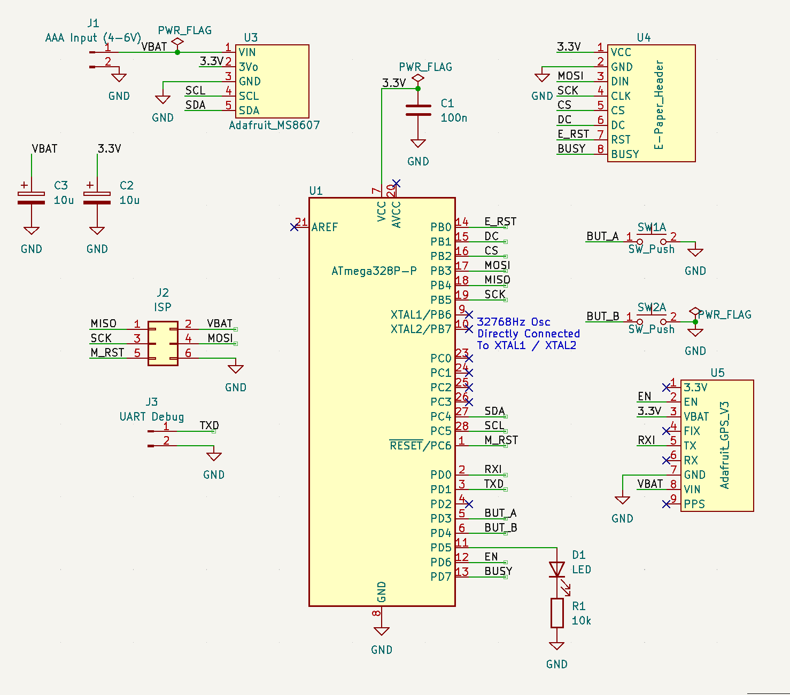

From the "easy" version above, you will need:

   * Waveshare 2.9 in EPaper Module
   * Adafruit MS8607 PHT monitor
   * Circuit board
   * Push switches
   * Case materials

You will also need

   * _Atmega328P DIP version ($2)_.
     [link](https://www.digikey.com/en/products/detail/microchip-technology/ATMEGA328P-PU/1914589)
     You can alternately opt for an SMD package version but soldering on the
     32k crystal will be harder.
   * _32768 Hz Crystal (<$1)_. [link](https://www.amazon.com/gp/product/B07Z2V95MJ)
     This oscillator is the key to low power in the design.
   * _Adafruit GPS Module ($30)_ [link](https://www.adafruit.com/product/746)
     This module is a bit higher quality than the one in the "easy" version in
     that it can track more satellites (for faster lock), provides and enable
     pin (for low power) and a port for keeping its memory active (for fast
     relock).  If all those features don't justify the added cost for you, you
     can hack a cheaper module to do the job by adding your own enable FET.  I
     explain how in upcoming steps.
   * _LED + Resistor_  The bare Atmega328P has no way to tell you if it's
     working, locked up, etc.  The blinking light thus provides a 1ms / second
     "heartbeat" that consumes almost no power but provides useful feedback.
     If you don't feel like you need it, you can omit it.
   * A couple of 10 uF and a 100 nF capacitors to smooth the power, which
     ranges from 50 uA to around 5-6 mA when refreshing the screen.
     If you feel lucky, you can try omitting these.
   * A 3x2 pin header for programming the chip via ICSP.  If you only program
     the chip off-board, you will not need this.
   * _Optional: A 1x2 pin header for UART debugging_.  You will only need this
     if the board is acting erratically.

## Arduino Mini version

I said there were two version but this is a bonus one (V2.5?).  It exists
because we live in a "parts drought" where chips like the Atmega328P go out of
stock for long periods.

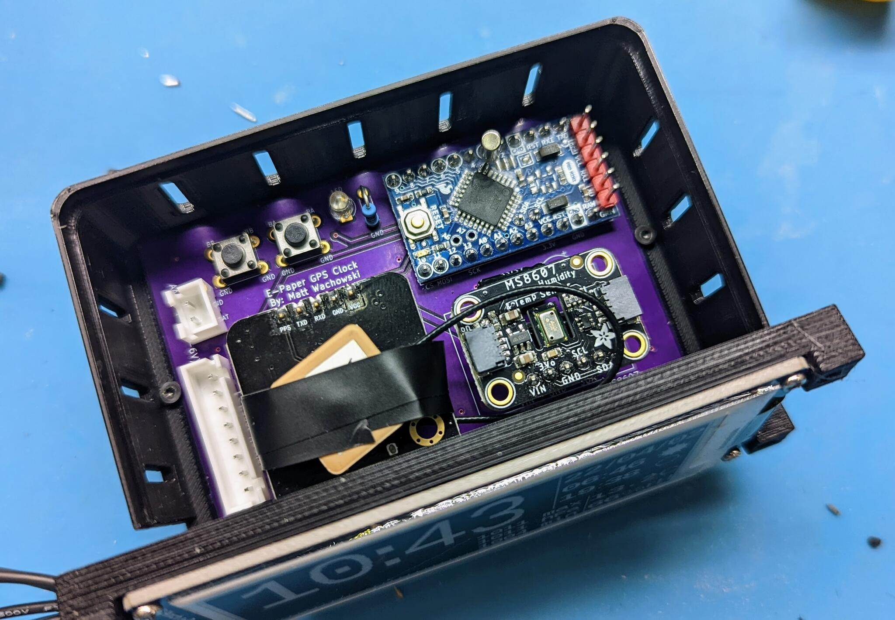

You can run this version with the "easy" firmware or, if you have
the soldering confidence, you can solder a 32k crystal on the board and go with the
32k version of the firmware (more details on the next section).

Here is the schematic.  This one is wired with a "cheap GPS" solution but you
can also go with the Adafruit GPS if you replace the GPS part of the schematic
with the Adafruit setup (as illustrated in the low power schematic).

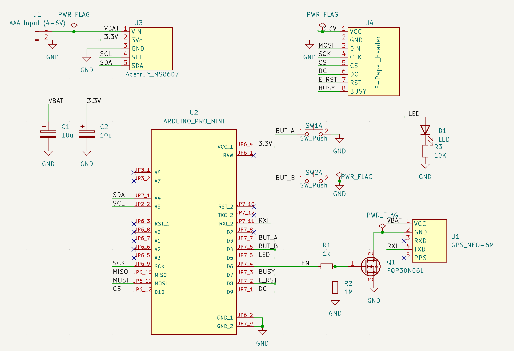

## Cheap GPS

That Adafruit GPS unit is expensive compared to the competition.  If you don't
think the added features (described above) are "worth it" you can drop in any
GPS module that transmits NMEA strings at 9600 baud (which is most of them).
**But now there is a new problem to solve:** most of these units lack an
enable/disable pin and GPS units typically consume 30-60 mA of power.  You can
hack a disable switch in using a N-MOSFET (or similar).  Here is the basic
idea:

[try it out](http://www.falstad.com/circuit/circuitjs.html?ctz=CQAgjCAMB0l3BWcMBMcUHYMGZIA4UA2ATmIxAUgoqoQFMBaMMAKADMLiUQUAWKwvx5Ds3MNCQwELAEoUMhEIIphuyqlSGSoUCSwBOSoczVCUfHZRYAPJQnJpeIDJAeuQTiwHEACgGUWACMlfHAUPGcwRRQwJ0gWAHd5RWVBATjEo3Ss8FUoFgBzHJQEFJFIOPzDBC5hTWJooSoweFkPZT5NUTqdTSpsaGxe3WkAZ3bPIV4GnuaQNgBDABtRugMPGc6NxVENZHg4Qu2QXePsbEUNFiA)

This power circuit has trade-offs.  See Appendix B for details if you are
interested in learning more about them.

## Low Power Hardware Mods

If running the "easy" version, you don't need to read this section.  For the
low power version, these mods will improve battery life significantly.

For illustration we will assume power is coming from a set of AAA batteries
which can supply 1000 mAh.  Let's assume you are using the 32k Adafruit version
and are doing no mods.  Here is an example power breakdown:

   * "Sleeping/Off" CPU, GPS, MS8607, and EPaper: Measured at 30-70 uA (we'll
     say 50uA)
   * Screen Update: 5 mA for 2 seconds once per minute: 5 * 2 / 60 = 166 uA
   * GPS Update: 50 mA for 10 seconds once per day: 50 * 10 / 86400 = 6 uA
   * MS8607 LED: 100 uA
   * Adafruit GPS pullup resistor: 500 uA

Thus we have 822 uA of average current draw which amounts to ~50 days of power.

Remove the MS8607 LED and the GPS pullup and we reduce power usage to 222 uA
which is ~187 days of power, significantly more!

### Remove the LED from the MS8607

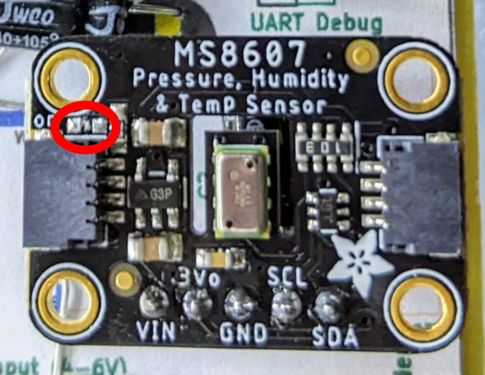

### Remove the "pullup" enable resistor from the Adafruit GPS module (if using)

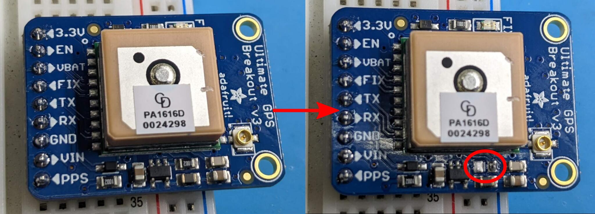

This was added by Adafruit to make the EN pin ignorable by inexperienced users.
But it has a big downside: when you pull it to ground (to disable the GPS) -
about 500uA is lost to heat in that pullup resistor!  Since the enable pin is
actively driven in the 32k oscillator design, you can remove the resistor.

### Pro mini mods

Google search "[Arduino mini low power](http://www.google.com?q=arduino%20mini%20low%20power)".
The TLDR is that you'll want to remove the voltage regulator and LED to reduce
power usage.  We are using the MS8607's voltage regulator (3.3V, 35-55 uA power
lost at idle) to power the pro mini.

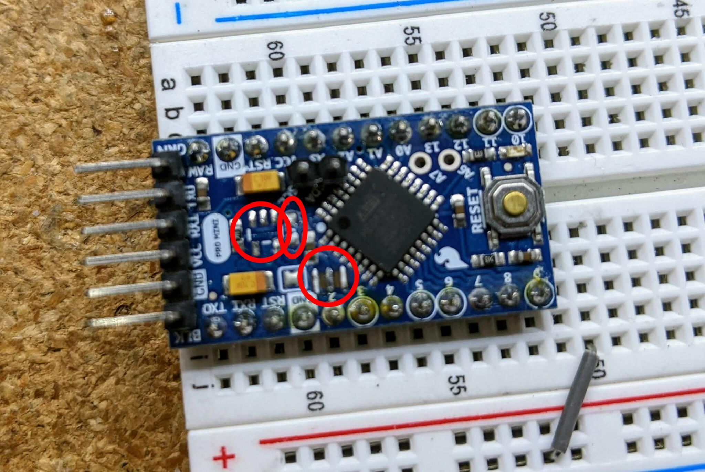

In the photo above, I also removed the crystal oscillator (lower right) to prep
the chip for a 32K crystal.  This is *only* for the 32k crystal version and
*only after* the fuses have been changed on the pro mini as explained later.

## Other notes

The "easy" design actually contains the same firmware features from the 32k
design you can take advantage of if you want:

   1. D5 is still driven as a status light so you can connect an LED/Resistor
      here if you want to.
   2. D6 is still driven as a GPS enable/disable so you can use it to turn the
      GPS on/off if you want to.

# Firmware Upload

This firmware is open source and is located at [link here].

I have included prebuilt firmware `.hex` files in the `firmware/` directory so
you likely do not need to build the code.

Still want to build it and possibly add your own modifications?  Here are some
tips:

## OPTIONAL: Building the .hex firmware files yourself

Note that this code does not use Arduino libraries because the resulting code
would be too big to fit on the Atmega328P (and it's my personal preference).
Instead it's written in C using the same AVR base libraries that Arduino also
uses as a base.  If you want to compile the code, you will need to install the
(free) `avr-gcc` tools, then go to the `firmware/` directory and type

    make

If the code builds, you'll want to open the `Makefile` and look at
these options:

    # This is the Low-power stand alone chip configuration.
    CLOCK_MODE ?= USE_32K_CRYSTAL
    UART_MODE ?= HARDWARE_UART
    F_CPU ?= 8000000
    
    # This is the easy-to-build firmware that is based on an Ardino Nano
    #CLOCK_MODE ?= USE_CPU_CRYSTAL
    #UART_MODE ?= SOFTWARE_UART
    #F_CPU ?= 16000000

If you are building the 32k crystal firmware, you are done.  If building the
nano version, you'll need to comment out the 32k lines and uncomment the nano
lines, then `make` the firmware again.

There is also a special debug mode that dumps log messages over the hardware
UART at 9,600 baud.  I think you can ignore it for now but keep it in mind as
something that might be useful for troubleshooting later:

    # Uncomment to activate debug via the UART TX (9600 baud)
    #DEBUG_CFLAG := -DDEBUG

Finally, you can decide how often the GPS should be activated by changing a
couple of variables.  By default, currently runs once per day but will run less
often if GPS takes a long time to lock in order to reduce battery drain.  Read
all about it in `src/gps.c`

## ICSP hardware

This section is for those uploading code to a stand-alone Atmega328P chip (or
burning Arduino Pro mini fuses).

You'll need what is called an ISP (or ICSP) programmer.  You can buy these for
around $10 [on amazon](https://www.amazon.com/gp/product/B0885RKVMC) or make
one yourself with a spare
[Aruino Uno/Nano](https://create.arduino.cc/projecthub/arjun/programming-attiny85-with-arduino-uno-afb829)
The options continue but I'll leave that to a Google search for
"[Arduino ISP Programmer](http://www.google.com?q=Arduino%20ISP%20Programmer)".
I will note that a lot of these guides assume your real goal is to install a
bootloader but for our case, no bootloader is needed as you'll be uploading
the `.hex` file directly.

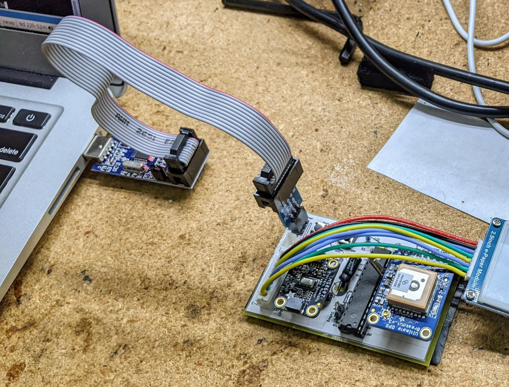

### Brownout detection

On my particular Atmega328P, the brownout detection as set to 3.5V (old version
of the chip?  A clone?) so I disabled
brownout detection with this command:

    /usr/bin/avrdude -patmega328p -cusbasp -Uefuse:w:0xFF:m

Your options may be different depending on your ISP programmer (the -c option).
You probably won't need it but just in case...

## Using avrdude

The popular Arduino IDE uses a free utility named `avrdude` to upload the hex files it creates to your
Uno/Nano/etc.  You can also download and use `avrdude` directly from the commandline
instead.  To get the correct options for the tool you can:

   1. Run an upload (blinking light demo or something) with the Arduino IDE
      with output logging turned on.  Then copy the command it used.  OR
   2. Read the official [avrdude docs](https://www.nongnu.org/avrdude/) OR
   3. Read one of the many many [avrdude tutorials](http://www.google.com?q=avrdude%20tutorial) on the internet.

For your reference, here is the `avrdude` command I used for the nano version (via `make upload`):

    /usr/bin/avrdude \
			-v \
			-patmega328p \
			-carduino \
			-P/dev/ttyUSB0 \
			-b57600 \
			-D \
			-Uflash:w:epaper_firmware_using_arduino_nano.hex:i 

and this is what I used for the ISP version:

    /usr/bin/avrdude \
			-v \
			-patmega328p \
			-cusbasp \
			-Uflash:w:epaper_firmware_using_arduino_nano.hex:i 

but there is a fair chance your setup is a bit different than mine.

## 32K Crystal

If you are building the "easy" version, skip this section.

If you are using the 32k crystal firmware, the crystal will need to be
installed for the firmware to operate.

**First (!)** You'll also want your ATMega328P set to use the internal 8 Mhz
crystal.  It's important to do this step first because the 32k crystal is using
the pins of the old crystal.  If you don't change these fuses, the chip will
become non responsive until you reconnect a 8 or 16 Mhz oscillator which
would be an annoying pain.  As far as I know the Arduino pro mini also needs
ISP to change the fuses (but I could be wrong).  I looked up "Arduino ISP" to
get the correct pin mappings for interfacing an ISP connector with a breadboard
as shown:

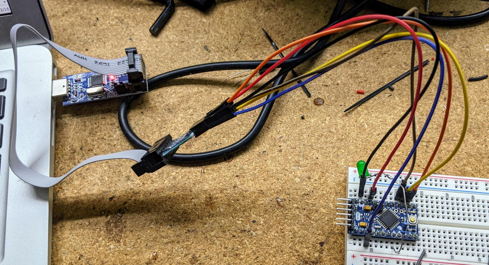

With my ISP programmer, I check with this command:

    $ avrdude -patmega328p -cusbasp
    ...
    avrdude: safemode: Fuses OK (E:FF, H:DE, L:E2)

The `L:E2` _is the setting you want for internal 8mhz_.  If your value is
different, you can update it with a command similar to this one:

    /usr/bin/avrdude -patmega328p -cusbasp -Ulfuse:w:0xE2:m

Then recheck.

Onto the hardware mod.  Here is a 32k crystal installed on a Atmega328P 

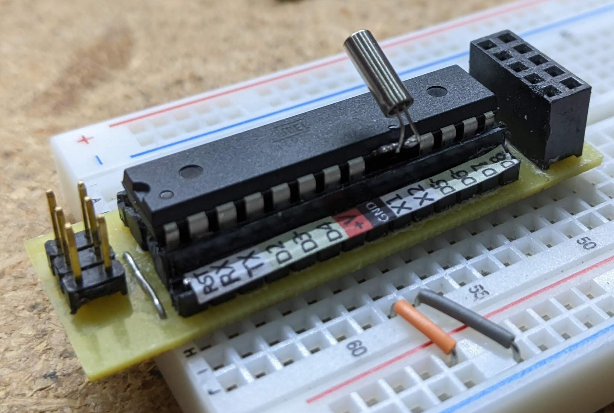

And on a Arduino Pro Mini (which also has the low power mods as-explained
earlier)

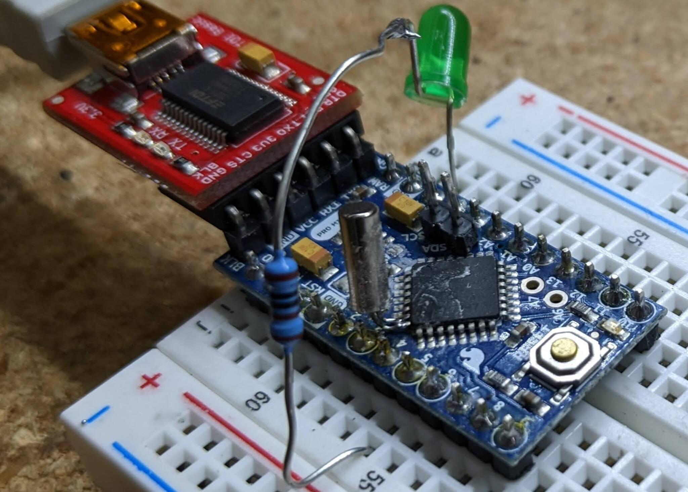

Attaching directly to the pins is recommended to reduce stray capacitance.  Too
much capacitance and the crystal will take longer to start oscillating (or fail
to start).

## Optional: First Steps

   * You can verify that things are OK so far on a breadboard by connecting
     just a LED/Resistor to D5 and uploading the firmware.  If all is well, the
     light will briefly flash once per second.
   * Next, you can add the EPaper display.  None of the data will be correct on
     the display but is should show something.
   * Next, add the PHT module
   * and finally the GPS module.

At this point, we are "done and can transfer everything over to a more permanent
fixture"

# Circuit Board assembly

Here you have the option of using a perf board, cutting the board with a CNC or
sending the design to a fab for manufacture.

The design files can be found in the `schematics/` directory and loaded into
Kicad.  There are three hardware flavors to choose from (all shown from behind
since that is how you would wire them by hand):

"Easy" Arduino Nano + Cheap GPS (always on)

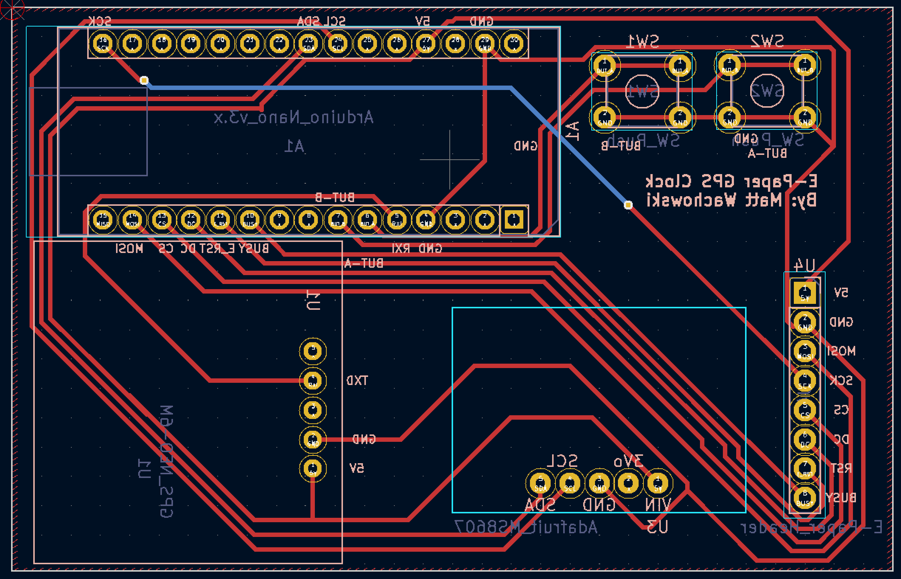

Raw ATMega328P + Adafruit GPS (low power)

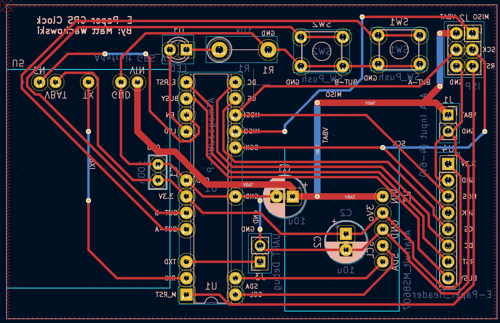

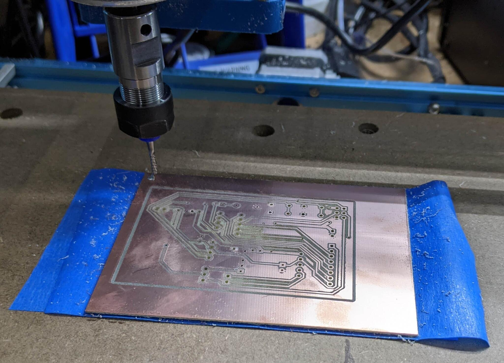

Pro Mini + Cheap GPS with MOSFET power cutoff

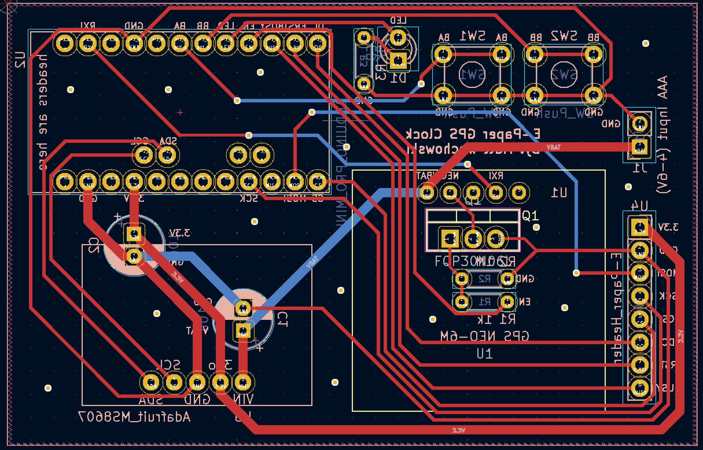

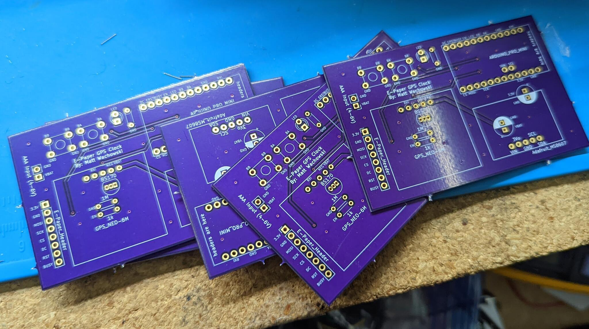

As can bee seen above, I cut the ATMega328P version with my CNC machine.  If
you have not used CNC to cut a PCB and are interested, try a google search for
"[3018 PCB](http://www.google.com?q=3018%20PCB)" and you'll
find many videos and articles on the topic.  I may do my own tutorial in a
separate article in the future but, since CNC is optional here it's not a good
place to go into details.  Isolation clearances are 0.4mm but you can go
narrower (probably not wider).  I used Flatcam to convert Kicad's Gerber output
to G-Code.  I included my Flatcam project in the schematic directory.  I also
included the G-Code files I sent to my 3018 CNC machine.  If you have a 3018
CNC, you can probably directly use the G-Code files, but do a "dry" run without
a bit first to make sure things look sane.

Anyway, when the circuit is finished and put together, it should function like
it did on the breadboard.  If you hold the select button on startup,
the GPS will be powered down (if possible) and you can try measuring the
current draw with your multimeter.  If you see 50-110 uA, we are seeing the
same result.  If not, you can unplug devices one at a time to try and narrow
down the parasitic power draw (assuming you didn't solder everything
permanently to the board).

# Case Design

You can design any type of case you want and I encourage you to be creative
here!  But I'll also share how I made my case and provide all of the files in
case you are interested in a more streamlined progression.

All of my design files are in the `case_design/` folder of the project.

My design uses a 3D printed support structure and two CNC parts: a top cover
and front panel.  The CNC parts are made of wood because I thought it would
look nicer than plastic.  I designed the whole thing upfront in OpenSCAD

I printed the main structure with 0.2mm layer height.  On my printer, the print
took a little over 5 hours.

I used OpenSCAD's "projection" feature to created 2D DXF files for the top
cover and front plate.  At this point, I would normally use a free program
called "Carbide Create" to make G-Code for the CNC machine.  But my face plate
has a 45 degree chamfer to the screen and Carbide Create is too basic of a
program to handle this well (at least my Google searches through forums on
    their website led me to that conclusion).  So I tried a different program
called "CamBam" and it worked very well.  CamBam is not free but you can use it
40 times for free.  I'm leaning toward purchasing the program but want to
experiment with it on a few more project first.

Some build photos:

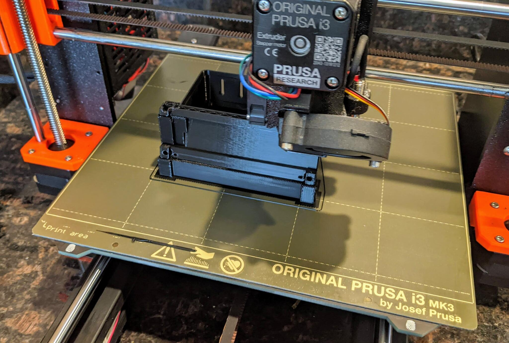
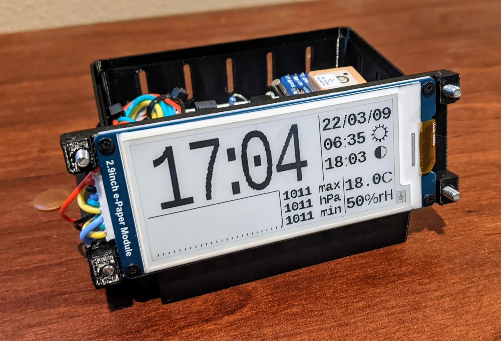
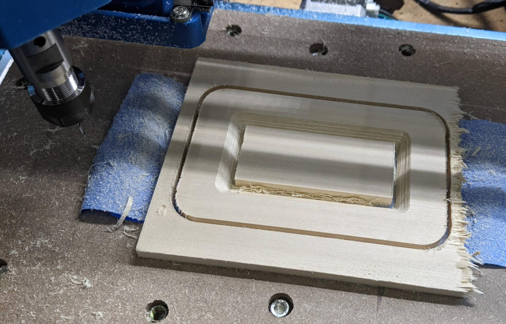
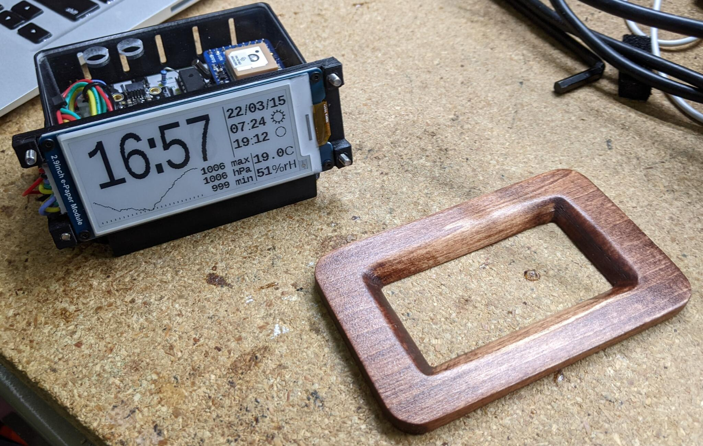
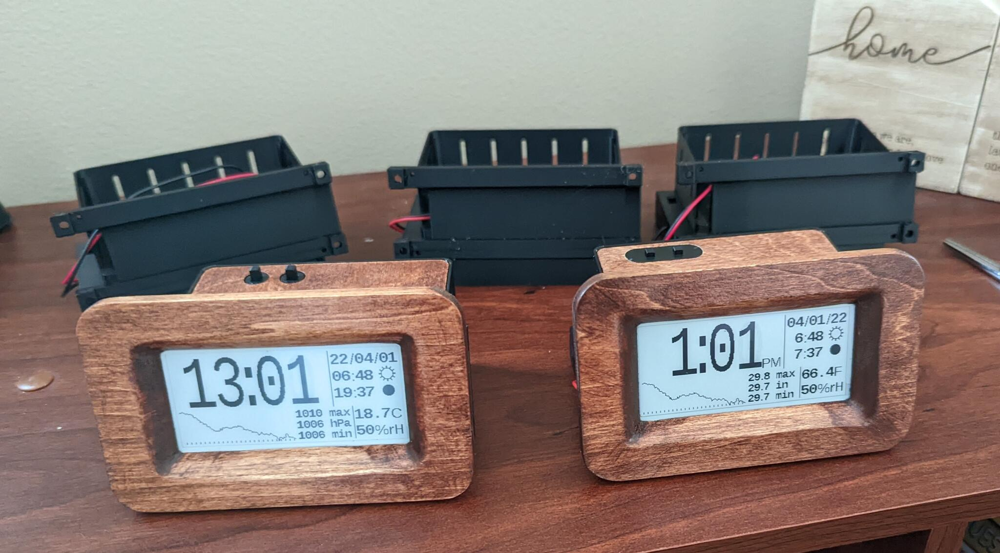

# Appendix A: Optional Clock Drift Correction

Your 32k/CPU crystal will not be perfect.  When the GPS turns on, it will
correct the drift.  But if the drift is bad or your GPS signal is bad, you can
also apply a correction in the firmware.  This currently requires you to build
the code.

At the top of `main.c` there are some commented out defines:

    // Clock drift correction
    // If your clock runs too fast or too slow, then you can enable these
    //#define CORRECT_CLOCK_DRIFT
    // number of seconds that a second should be added or removed
    //#define CLOCK_DRIFT_SECONDS_PER_CORRECT 1800
    // define this if the clock is too slow, otherwise leave it commented out
    //#define CLOCK_DRIFT_TOO_SLOW

You can uncomment all of the `#define` statements above to enable the correction.
You only uncomment `CLOCK_DRIFT_TOO_SLOW` of your clock is falling behind.
If your clock is too fast, leave it commented.

The only thing left to do is set `CLOCK_DRIFT_SECONDS_PER_CORRECT`...

### The math way

Wait a handful of hours, then see how much the clock has drifted.  For example,
you might wait 23 hours.  If at that point you see the clock has lost 10
seconds, then your correction would be: (3600 * 23) / 10 = 8280 seconds
per correction.

    #define CORRECT_CLOCK_DRIFT
    #define CLOCK_DRIFT_SECONDS_PER_CORRECT 8280
    #define CLOCK_DRIFT_TOO_SLOW

If you already set `CLOCK_DRIFT_SECONDS_PER_CORRECT` and find you want to fine
tune it _even more_, then you need to add (if too slow) or subtract (if too
fast) `int(SECONDS_ON / CLOCK_DRIFT_SECONDS_PER_CORRECT)` to the error term
in the denominator to account for the already-corrected error seconds.
Building on the example above, if _we were still_ 2 seconds slow after 20
hours, the calculation would be.  (3600 * 20) / (int(3600 * 20 / 8280) + 2) =
7200.

### The non math way

Just try a number like 5,000 and refine it as you note that the clock is still
to fast or too slow.  Still too slow?  Try 2,500.  Too fast?  Try 10,000.  Keep
notes and iteratively refine it to some acceptable value just like the number
guessing games you may have played at some point.

# Appendix B: Cheap GPS power control (The tale of the BS170 N-MOSFET)

Revisiting the power control circuit described in the "Cheap GPS" section.

[try it out](http://www.falstad.com/circuit/circuitjs.html?ctz=CQAgjCAMB0l3BWcMBMcUHYMGZIA4UA2ATmIxAUgoqoQFMBaMMAKADMLiUQUAWKwvx5Ds3MNCQwELAEoUMhEIIphuyqlSGSoUCSwBOSoczVCUfHZRYAPJQnJpeIDJAeuQTiwHEACgGUWACMlfHAUPGcwRRQwJ0gWAHd5RWVBATjEo3Ss8FUoFgBzHJQEFJFIOPzDBC5hTWJooSoweFkPZT5NUTqdTSpsaGxe3WkAZ3bPIV4GnuaQNgBDABtRugMPGc6NxVENZHg4Qu2QXePsbEUNFiA)

The power cutoff circuit above is called a "low side switch".  It's benefit is
that it's relatively easy to understand and the part count is low.  That said,
there are some design concerns:

   * The ground of the GPS is not tied to GND but on the MOSFET drain.  This 
     means that the UART signal from the GPS to the microcontroler will have
     the MOSFET voltage drop added to it (Vds), increasing noise sensitivity
     and possibly causing outright errors. 
   * You would not want to use this design if your microcontroller inputs
     are specified as 3.3V maximum (the ATMega328P I chose doesn't have this
     limitation).
   * 3.3V (EN pin above) is not a very strong turn-on voltage for a typical MOSFET.

But hey, the UART is a digital signal and the ground difference isn't *that*
much so maybe it will work anyway?  I tried it and it worked fine... at first
but I came to discover over time that it was not reliable.  To understand
*why*, we refer to the characteristic curves of the BS170 I originally chose as
my N-MOSFET:

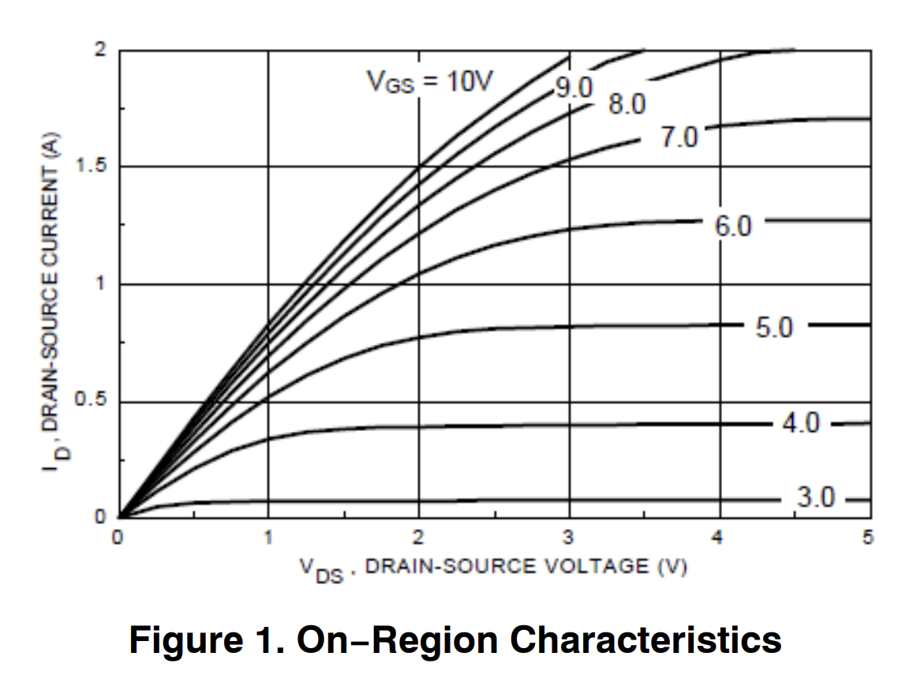

At 3.3V on the X axis we will be sitting between the 3.0 and 4.0V lines on the
graph.  So maybe we'll get 100mA?  Maybe enough?

My multimeter was telling me the GPS consumes 40-60ma while on but I think this
is an average value.  Depending on what the GPS was trying to do, it just
needed more current than the transistor was willing to allow, thus the GPS
ground (MOSFET drain) voltage would rise.  This created both UART errors and
reduced overall voltage to the GPS unit which would sometimes still sort of
work and other times go into a reset loop.

One solution would be to go with a "high side" with an additional P-MOSFET on
top to make it happen.  This eliminates the separate ground issue and provides
a full 5V (battery) gate voltage swing, which will turn the associated P-MOSFET
fully on:

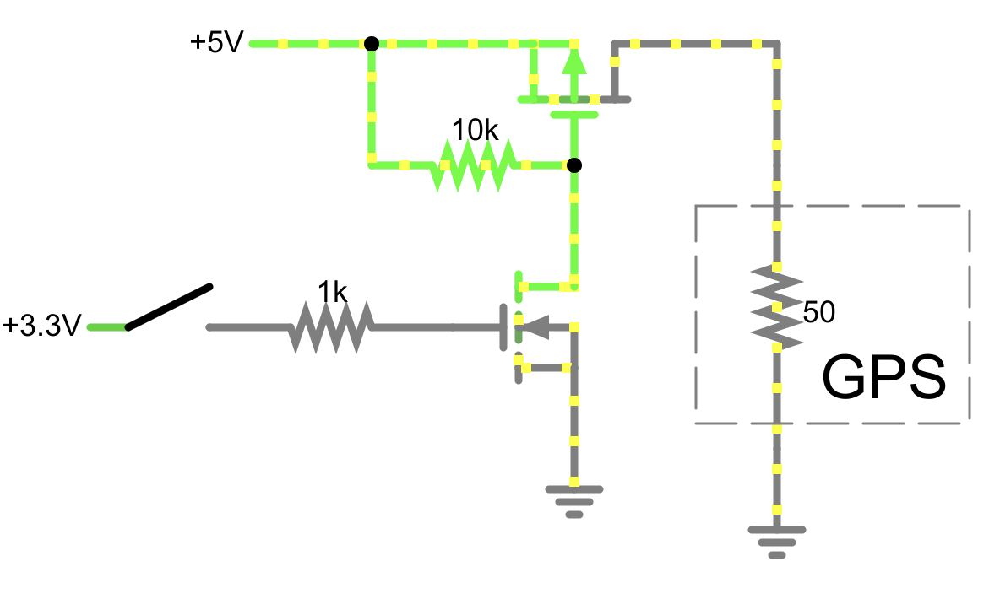
[try it out](http://www.falstad.com/circuit/circuitjs.html?ctz=CQAgjCAMB0l3BWcMBMcUHYMGZIA4UA2ATmIxAUgoqoQFMBaMMAKADMLiUQUAWKwvx5Ds3MNCQxIKdiEFUwGQnKFgUeELwjjJsGQCcVCpRULHlC+JBYB3OX3DrTCp9bsIzjjR-NQWAJWcvTWJlNQ0qKiFJKCgJFkMMNHATJKp1CJoWAA8QHHIiDQw8AowIXmEQAHEABQBlFgAjOTwNMC480J5ivwBzPOSMgapRSL87Qg9gtOC3YenkxQtbIxTleR4Ha36NlCmN3ArIhM5uPiiu89iweADNQWEo0UfYqJHobFe4hBYAZ3uKldeJchAoQGwAIYAG1+dBYQA)

But in my optimism, I had already ordered PCBs with the lowside wiring so my
secondary solution was to abandon the BS170 and go with a FQP30N06L instead.
This higher-current MOSFET (max 30A!) seems like serious overkill, and it is
but its curves look like this:

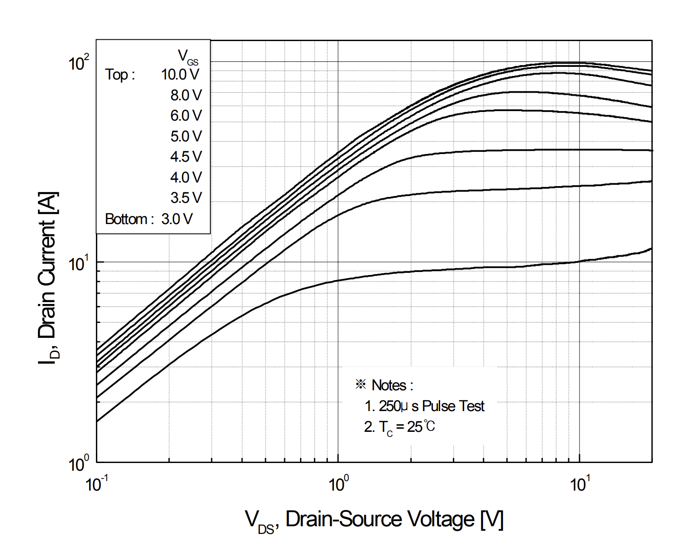

Around 10A of current allowance at 3.3V which is a 100x improvement over the
BS170 and should now be plenty.  And indeed the instabilities have not
returned.

